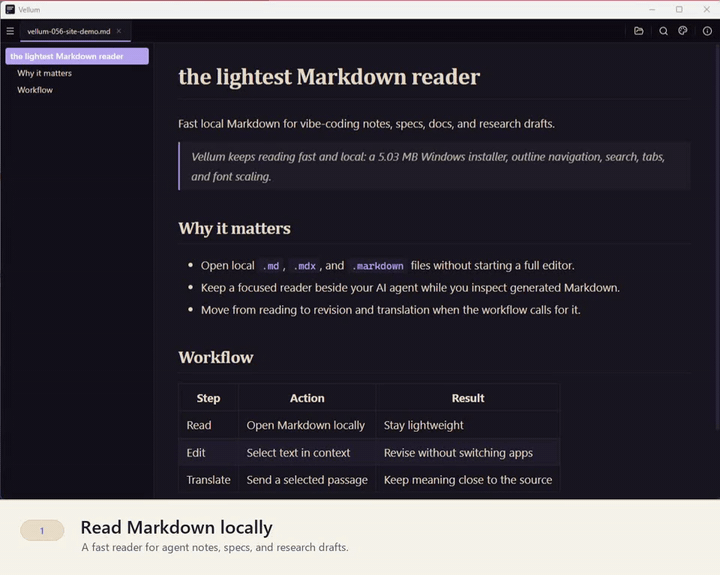

<p align="center">
  
</p>

<h1 align="center">Vellum Lite</h1>

<p align="center">
  <b>The lightest Markdown reader</b> — tiny, local, and good-looking.<br/>
  A ~5&nbsp;MB desktop reader for the Markdown your AI agent just wrote.
</p>

<p align="center">
  <a href="LICENSE"></a>
  
  
  <a href="https://sciscale.org/vellum"></a>
</p>

<p align="center">
  <a href="https://sciscale.org/vellum">
    
  </a>
  <br/>
  <sub><a href="https://sciscale.org/vellum">▶ Watch the full demo and download at sciscale.org/vellum</a></sub>
</p>

---

Vellum Lite is the **free, open-source** edition: open a local `.md`, scan the
outline, read it on a calm page. No account, no cloud, no vault.

## Features

- **Local-first** — open `.md` / `.mdx` / `.markdown` straight from disk
- **Rich Markdown** — GFM tables, task lists, syntax-highlighted code
- **Math** — KaTeX for inline and display math
- **Diagrams** — Mermaid and Vega-Lite
- **Frontmatter** — YAML frontmatter rendered as a structured Properties panel
- **Outline** — jump anywhere from a live document outline
- **Tabs & recent files** — open several files; `Ctrl+Tab` to switch
- **Search** — `Ctrl+F` in-page search with match highlighting
- **Font scaling** and **light / dark** themes
- **File association** — register as the default `.md` app on Windows, macOS, Linux
- **Live reload** — on-disk changes are picked up automatically

## Download

Pre-built installers are at **[sciscale.org/vellum](https://sciscale.org/vellum)**
— Windows `.exe`/`.msi` and macOS `.dmg`. The builds aren't code-signed yet, so
SmartScreen / Gatekeeper may ask for confirmation the first time.

## Vellum Pro

**Pro** is an optional one-time paid upgrade that adds rendered-view editing,
selection translation (bring-your-own-key, or SciScale-hosted), and three extra
reading styles. Lite stays free and open-source — Pro just unlocks the heavier
tools when AI-written Markdown needs revision. Details at
[sciscale.org/vellum](https://sciscale.org/vellum).

## Build from source

Requires Node.js, the Rust toolchain, and the
[Tauri prerequisites](https://tauri.app/start/prerequisites/) for your OS.

```bash
npm install

# build the desktop installers (output under src-tauri/target/release/bundle)
npm run tauri:build:lite

# or just the web frontend
npm run build:lite
```

## License

[GPL-3.0](LICENSE) © 2026 Yue Li / SciScale.

Inspired by [Obsidian](https://obsidian.md).

---

<p align="center">
  A <a href="https://wow.sciscale.org">SciScale Studio</a> project.
</p>
